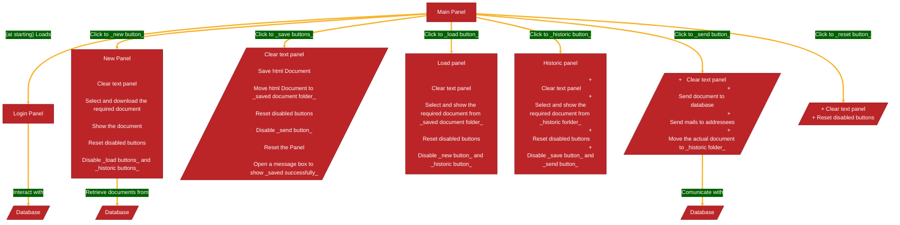

# Flow Chart

```mermaid
%%{
  init: {
    'theme': 'base',
    'themeVariables': {
      'primaryColor': '#BB2528',
      'primaryTextColor': '#fff',
      'primaryBorderColor': '#7C0000',
      'lineColor': '#F8B229',
      'secondaryColor': '#006100',
      'tertiaryColor': '#fff'
    }
  }
}%%
graph TD;
  A[Login Panel] == Interact with ==> B[/Database/]
  C[Main Panel] == (at starting) Loads ==> A
  C == Click to _new button_ ==> D[New Panel

                                     Clear text panel
                                    Select and download the required document
                                    Show the document
                                    Reset disabled buttons
                                    Disable _load buttons_ and _historic buttons_]
  D == Retrieve documents from ==> E[/Database/]
  C == Click to _save buttons_ ==> F[/ Clear text panel
                                       Save html Document
                                       Move html Document to _saved document folder_
                                       Reset disabled buttons
                                       Disable _send button_
                                       Reset the Panel
                                       Open a message box to show _saved successfully_/]
  C == Click to _load button_ ==> G[Load panel

                                    Clear text panel
                                    Select and show the required document from _saved document folder_
                                    Reset disabled buttons
                                    Disable _new button_ and _historic button_]
  C == Click to _historic button_ ==> H[Historic panel

                                        +   Clear text panel
                                        +   Select and show the required document from _historic forlder_
                                        +   Reset disabled buttons
                                        +   Disable _save button_ and _send button_]
 C == Click to _send button_ ==> I[/ +   Clear text panel
                                     +   Send document to database
                                     +   Send mails to addressees
                                     +   Move the actual document to _historic folder_/]
 I == Comunicate with ==> J[/Database/]
 C == Click to _reset button_ ==> K[/ +   Clear text panel
                                      +   Reset disabled buttons/]
```
